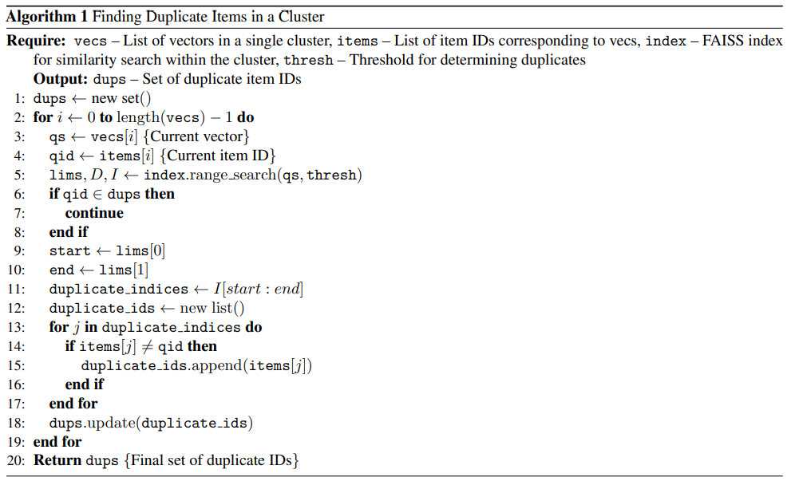

# data-deduplication-pipelines
This is a codebase reproducing the data deduplication pipeline used in Stable-Diffusion-3 and Dall-E2 development. Basically, we follow the description in the SD3 paper'a appendix to reproduce this pipeline. 

## Step1: Embedding Extraction
Following SD3, we use the SOTA model, [SSCD](https://github.com/facebookresearch/sscd-copy-detection), to extract image's embeddings. Then we index all the embeddings using [autofaiss](https://github.com/criteo/autofaiss). The next steps are based on [autofaiss](https://github.com/criteo/autofaiss) and [faiss](https://github.com/facebookresearch/faiss).

```python
python embedding_extract.py --model_path "/path/to/sscd_disc_large.torchscript.pt" --part_index 0 --data_file_path "/path/to/your_data_file.json" --save_root_path "/path/to/save_dir"
```
## Step2: Clustering
We use the basic K-means algorithm to cluster all the indices.
```python
python cluster_and_deduplication.py
```
## Step3: Data Deduplication
Following the seudo code in SD3's appendix, we deduplication all the data in each cluster.

```python
python cluster_and_deduplication.py
```
